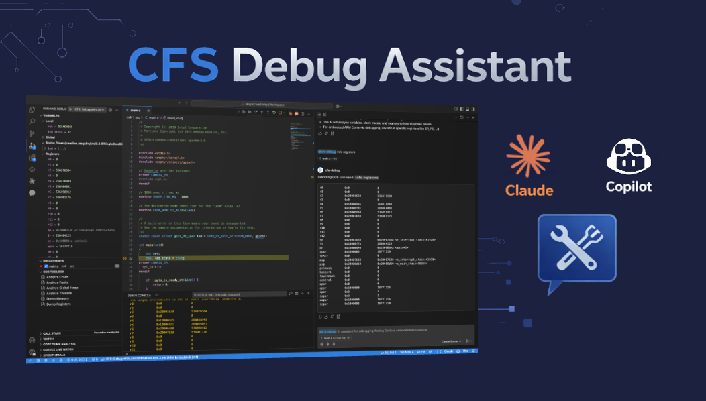

# AI Debug Assistant

!!! info "Preview"
    The AI Debug Assistant is currently in preview and may change in future releases.

The AI Debug Assistant is an agentic AI system built into CodeFusion Studio that actively participates in your debug sessions. Rather than answering static questions about your source code, it can autonomously investigate faults, inspect live hardware state, coordinate across multiple cores, and reason about what your silicon is actually doing - all in real time.

The Assistant is built on the [:octicons-link-external-24: Model Context Protocol (MCP)](https://modelcontextprotocol.io/){:target="_blank"}, an open standard created by Anthropic that enables AI models to securely connect to external tools and data sources. This open architecture means the AI Debug Assistant is not locked to a single AI provider or interface. Today it supports GitHub Copilot in VS Code and Claude Code. As the ecosystem grows, it will work with whatever AI client your team adopts.

In this section you'll find:

- [Getting started](getting-started.md) — prerequisites, enabling the MCP server, and connecting AI clients.
- [Using the AI Debug Assistant](using-ai-debug-assistant.md) — working with GitHub Copilot Chat (including Agent Mode) and Claude Code, with real-world debugging examples.
- [Tools and workflows reference](reference.md) — full reference for all debug tools and pre-built diagnostic prompts.
- [Troubleshooting](troubleshooting.md) — troubleshooting guidance and information.

## What makes this different

There is a meaningful difference between an AI that suggests the next line of code and one that can autonomously coordinate debug sessions, read fault registers, decode exception frames, correlate a shared-memory conflict, and tell you that your DMA descriptor on Core 1 is racing against a buffer reallocation on Core 0.

The AI Debug Assistant bridges that gap. It enables **agentic debugging workflows** — where the AI doesn't wait to be guided step by step, but instead autonomously orchestrates multi-step investigations, correlates hardware state across subsystems, and reports findings in plain language.

## What it can do

The AI Debug Assistant exposes a comprehensive set of debug tools, contextual resources, and pre-built diagnostic prompts through the MCP protocol.

| Capability | Description |
|---|---|
| **Session control** | Start, stop, restart, continue, pause, and step through debug sessions |
| **Hardware state inspection** | Read registers, memory, variables, stack traces, and thread lists directly from the target |
| **Breakpoints and watchpoints** | Set, list, and remove breakpoints — including conditional breakpoints — and hardware watchpoints |
| **GDB command execution** | Run GDB commands with built-in safety guards that block destructive operations |
| **Fault decoding** | Automatically parse ARM Cortex-M fault registers (CFSR, HFSR, BFAR, MMFAR) and RISC-V exception registers (mcause, mtval, mepc) into human-readable diagnoses |
| **ELF binary analysis** | Surface symbol sizes, stack usage, section layout, and the largest consumers of flash and RAM |
| **Structured diagnostic prompts** | Pre-built investigation sequences for crash diagnosis, memory corruption, peripheral misconfiguration, multi-core debugging, and more |

## Supported AI clients

| Client | How it connects |
|---|---|
| **GitHub Copilot** | Automatically registered by VS Code's MCP integration (VS Code 1.96.0+). Use `@cfs-debug` in GitHub Copilot Chat, or let Agent Mode drive autonomous investigations. |
| **Claude Code** | Run `claude mcp add --transport http cfs-debug http://localhost:<port>/mcp` to register the server (replace `<port>` with the port assigned at startup). See [Getting started](getting-started.md) for details. |
| **Any MCP-compatible client** | The MCP server runs as a local HTTP service on a configurable port. Any client that speaks JSON-RPC over Streamable HTTP can connect. |
