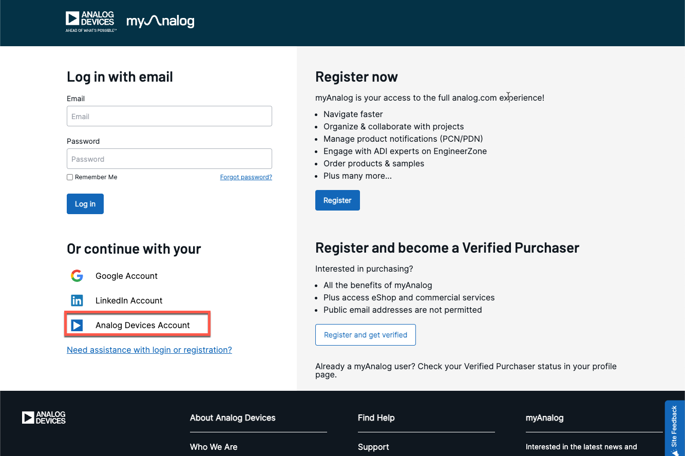

# Access restricted packages (using myAnalog login)

Some components in CodeFusion Studio are distributed as restricted packages. These packages are available through additional package remotes, and may require you to authenticate with your myAnalog account before they can be installed.

If you don’t already have a myAnalog account, you can create it at [:octicons-link-external-24: analog.com/myAnalog](https://www.analog.com/myAnalog){:target="_blank"}.

!!! note
    Access to some packages is restricted to authorized users. If you believe you should have access but cannot see the required packages, contact your account representative.

## Add the package remote

Restricted packages require a custom package remote to be added before installation. Your organization  provides the remote name and URL if needed. After adding the remote, CodeFusion Studio prompts you to authenticate using your myAnalog account if required.

### Option 1: From the Command Palette

1. Open the **Command Palette** from the **Manage** gear icon or using the keyboard shortcut (`Ctrl+Shift+P` or `Cmd+Shift+P` on macOS).
2. Type `CFS Add Custom Package Remote` and press Enter, or select it from the list.
    
    
3. Add the remote name and URL.
4. Choose **myAnalog** from the list of authentication options.

    !!! important
        When the authentication prompt appears in VS Code, keep the VS Code window in focus. Clicking outside the application dismisses the prompt, which can cause the remote to be added without authentication and may lead to package installation errors. If this happens, you will need to reauthenticate to access restricted packages. For more details, see [Restricted packages not appearing](troubleshooting-package-manager.md#restricted-packages-not-appearing).

5. Click **Login**, then click **Open** to launch the browser. If the browser does not open, use the **Copy link** button to copy the link and paste it in your browser.
6. Log in to your myAnalog account.
    
7. When prompted, close the browser window and return to VS Code.
8. A VS Code notification confirms you are logged in.

### Option 2: From the command line `cfsutil`

To access `cfsutil`, open a new terminal (**View > Terminal** or ``Ctrl+` ``). Then complete the following steps:

1. In the terminal panel, click the dropdown arrow next to the **+** icon.
2. Select **CFS Terminal** from the list.
    
    
3. Run the following command to add the remote:

    ```bash
    cfsutil pkg add-remote <remote-name> <url>
    ```

    !!! example

        ```sh
        cfsutil pkg add-remote myserver https://my.server.url
        ```

4. Log in to the remote:

    ```bash
    cfsutil pkg login <remote-name> --with-myanalog
    ```

    !!! example

        ```sh
        cfsutil pkg login myserver
        ```

5. Authenticate using your myAnalog account:

    ```bash
    cfsutil auth login
    ```

6. A browser opens automatically, prompting you to sign in to your myAnalog account. If the browser does not open, copy the authentication link from the terminal and paste it into your browser manually.

!!! note
    To run `cfsutil` from a system terminal outside VS Code, run the following executable:  

    - **Windows:** `<CFS-Install>/Utils/cfsutil/bin/cfsutil.cmd`.
    - **Linux/macOS:** `<CFS-Install>/Utils/cfsutil/bin/cfsutil`.

!!! important
    Your myAnalog login session may expire after a period of inactivity. If this happens, you will need to reauthenticate to access restricted packages. For more details, see [Restricted packages not appearing](troubleshooting-package-manager.md#restricted-packages-not-appearing).

## Verify your setup

After adding the remote and completing authentication, verify that the remote was added correctly.

Run the following command in the **CFS Terminal**:

```bash
cfsutil pkg list-remotes
```

## Next steps

Now that you are logged in, you can proceed to install packages in CodeFusion Studio.
Choose your preferred method below:

- To install packages from the Command Palette, see [Manage packages from VS Code Command Palette](manage-packages-command-palette.md).
- To install packages using the command line, see [Manage packages from the command line (`cfsutil`)](manage-packages-cfsutil.md).
